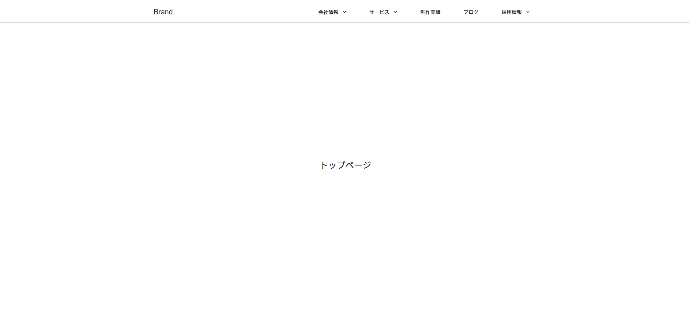
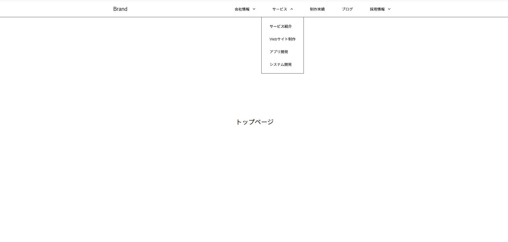
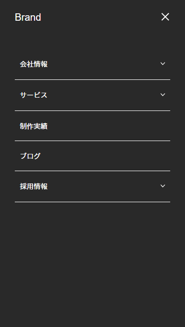
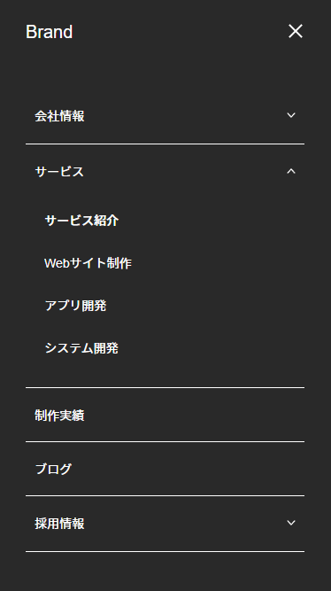

# Next.js Dropdown Menu Accessible

## 概要
このリポジトリは、Next.js（App Router）と TypeScript を用いて構築した、レスポンシブ対応かつアクセシビリティに配慮したドロップダウン付きグローバルナビゲーションメニューの実装例です。  
UIの操作性・コードの保守性・アクセシビリティを意識した設計にしており、フロントエンド開発における実装力や設計力の一例として活用できるよう構成しています。  
汎用的な構成のため、Webサイトやプロジェクトでの**ナビゲーションテンプレートとして再利用可能**です。

## 技術スタック

- Next.js 15.2.4（App Router）
- TypeScript
- CSS Modules
- React Hooks
- HTML / WAI-ARIA（アクセシビリティ対応）
- Node.js（開発環境）

## 主な特徴

- Next.js App Router 構成（app/ ディレクトリ）対応

- TypeScript 使用 / 外部状態管理ライブラリなし

- レスポンシブ対応（PC・SP 両対応）  
  ・PC：クリックまたはキーボード（Enterキー）でドロップダウンメニュー操作可能  
  ・SP：ハンバーガーメニュー（Drawer）展開時にドロップダウンメニュー表示。クリックまたはキーボード（Enterキー）でドロップダウンメニュー操作可能

- アクセシビリティ対応  
  ・`aria-expanded`, `aria-hidden`, `aria-label` などの**適切な属性管理**  
  ・Drawer展開時の**フォーカストラップ**（Tabキーの巡回制御）を**カスタムフックで実装**  
  ・**Escキー**で Drawer 閉じる操作に対応  
  ・ページ遷移後、**最初のTabキーでロゴからフォーカスが始まる**ように制御  
     → SPAにありがちな **「前ページのフォーカスが残る問題」**を防ぎ、**MPAのように自然でわかりやすいキーボードナビゲーション体験**を実現しています。

- **ユーザー操作に応じた状態リセット処理**  
  ・ページ遷移時にドロップダウンメニューや Drawerの状態を**自動でリセット** 
  　（`pcActiveIndex`, `drawerActiveIndex`, `isOpen` を初期化）  
  ・ナビゲーション外をクリックした際、ドロップダウンメニューを自動で閉じる

- 共通スタイル以外は、CSS Modules によるスコープ付きスタイル設計

- 機能ごとにカスタムフックを分離し、再利用性と保守性を担保  
   （`useResetOnRoute`, `useDrawerResize`, `useDrawerFocusTrap`, `useOutsideClick` など）

## スクリーンショット

### パソコン表示
#### 通常時

#### ドロップダウンメニュー展開時

### スマートフォン表示
#### Drawer展開時の通常時

#### Drawer展開時のドロップダウン展開時

## 使い方

1. Node.js をインストール（推奨バージョン: 18.x以上）

2. リポジトリをクローン

   git clone https://github.com/your-username/nextjs-dropdown-menu-accessible.git
   
   cd nextjs-dropdown-menu-accessible

3. 依存パッケージのインストール

    npm install

4. 開発サーバーの起動

5. ブラウザで http://localhost:3000 にアクセスして動作を確認できます。